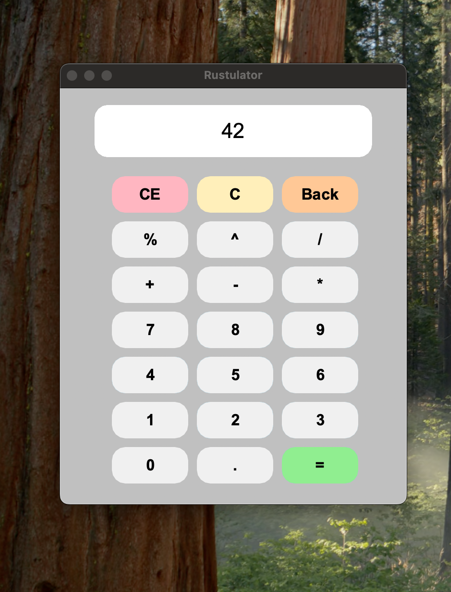

# Rustulator

Rustulator is a small project aimed at gaining exposure to the Rust programming language.
This project is a simple calculator built using Rust - it is far from perfect!



## Building the Rustulator
  ```sh
  cargo build --release
  ```
  After building, the executable can be found inside `target/release`:
  ```sh
  ./target/release/rustulator
  ```

## Running the Rustulator with HMR

Hot Module Replacement (HMR) allows you to see changes in real-time without restarting the application. To run the Rustulator with HMR:

1. Install the necessary tools:
  ```sh
  cargo install cargo-watch
  ```
2. Run the project with HMR:
  ```sh
  cargo watch -x 'run'
  ```
